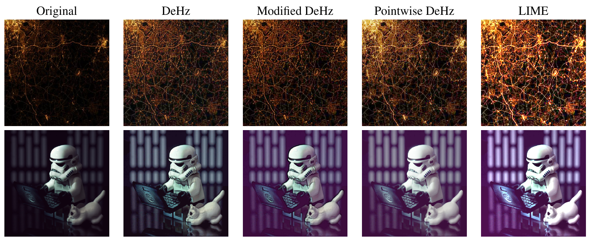

# Fast DeHz

Fast DeHz for real-time low-light enhancement



## How to use

```
python flow.py [video]
```

If you want to evaluate on a single frame

```
python dehz.py [image]
```

## Performance

Settings

* Frame size: 640x480
* CPU: Intel(R) Core(TM) i5-8250U CPU @ 1.60GHz


